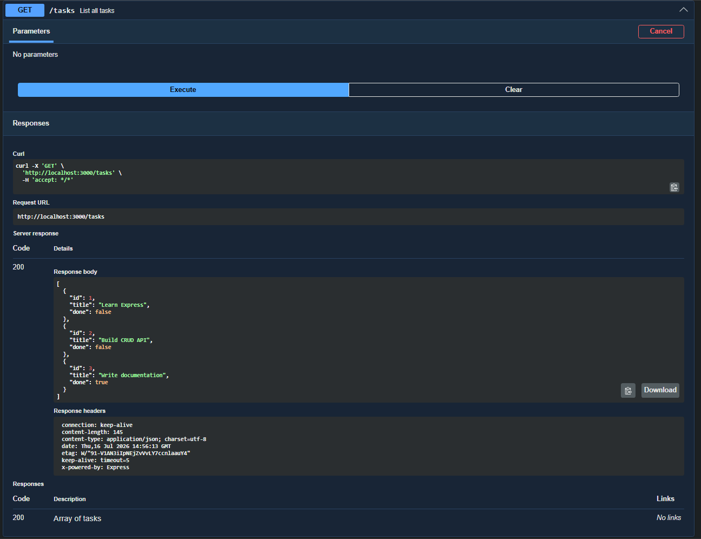
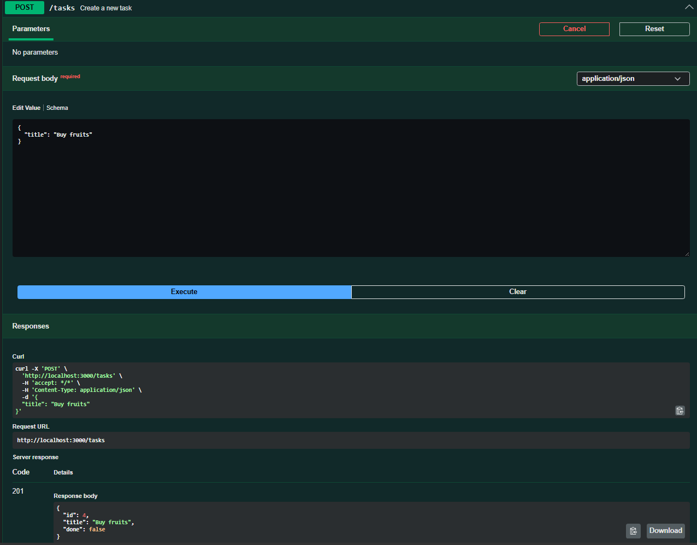
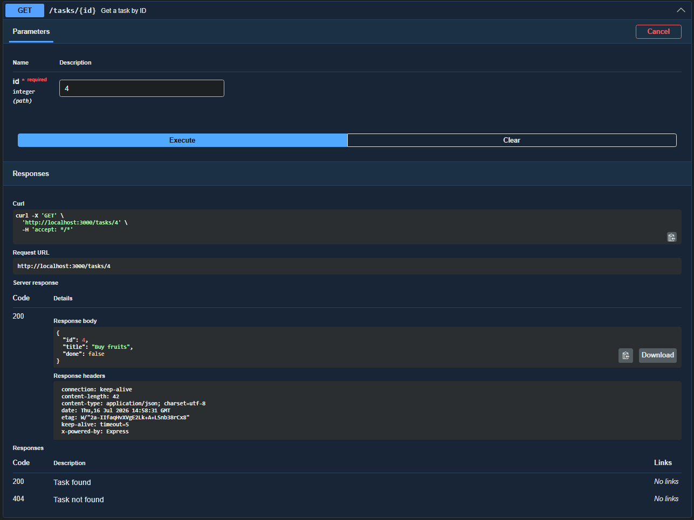
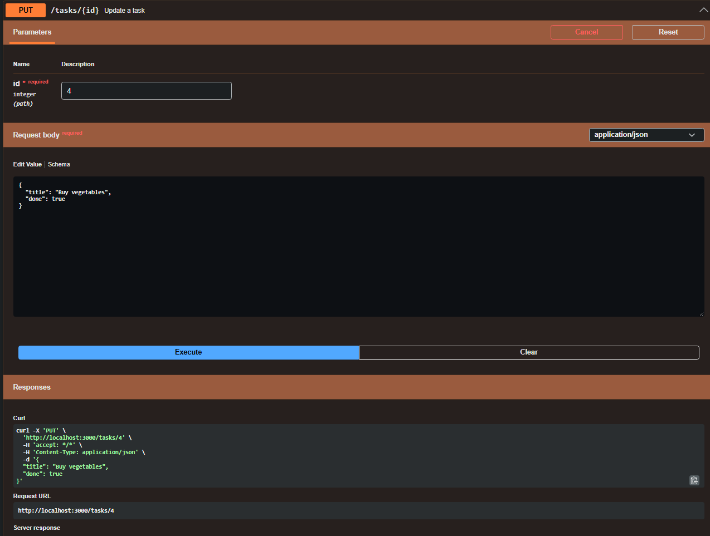
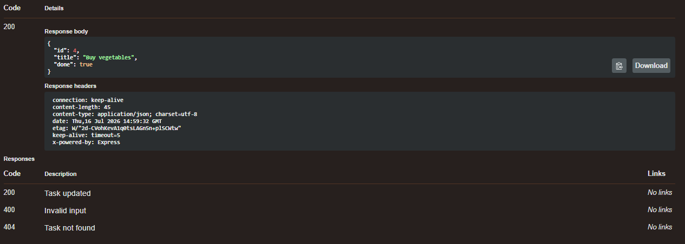
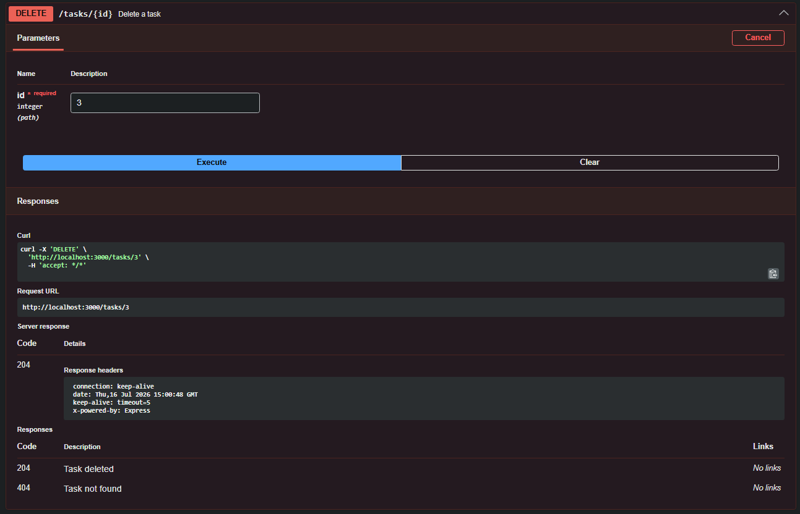
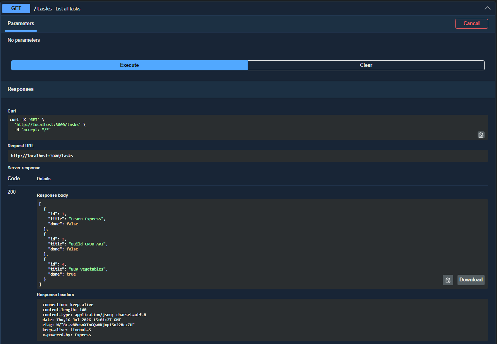
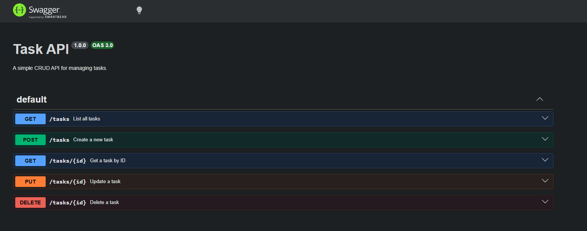

# Task API — Express.js CRUD Service


A simple, clean, fully‑documented CRUD API for managing tasks, built with Node.js, Express, and Swagger UI. This project demonstrates the fundamentals of REST API design, validation, routing, and interactive documentation using OpenAPI.

## Table of Contents

- [Features](#features)
- [Project Structure](#project-structure)
- [Tech Stack](#tech-stack)
- [Installation](#installation)
- [Running the Server](#running-server)
- [API Endpoints](#api-endpoints)
- [Swagger UI Documentation](#swagger-ui-documentation)
- [Example cURL Commands](#example-curl-commands)
- [OpenAPI Specification](#openapi-specification)
- [Roadmap](#roadmap)
- [Author](#author)

## Features

- Full CRUD operations

- Input validation

- Proper HTTP status codes

- In‑memory data store

- Swagger UI documentation

- Clean, predictable REST structure

- Beginner‑friendly but production‑style code layout

## Project Structure

    ├── app.js

    ├── openapi.json

    ├── package.json

    └── README.md

## Tech Stack

- Node.js — JavaScript runtime

- Express.js — Web framework

- Swagger UI Express — Interactive API documentation

- OpenAPI 3.0 — API specification format

## Installation

```bash
git clone <your-repo-url>
cd task-api
npm install
```

## Running the Server

```bash
node app.js
```

**Server Runs at:**

```bash
http://localhost:3000
```

**Swagger UI runs at:**

```bash
http://localhost:3000/docs
```

## API Endpoints

**GET /tasks — List all tasks**

Returns an array of all tasks.



---

**POST /tasks — Create a new task**

Creates a task with a title and sets done to false.



---

**GET /tasks/{id} — Get a task by ID**

Returns a single task if found.



---

**PUT /tasks/{id} — Update a task**

Updates the title and/or done status.





---

**DELETE /tasks/{id} — Delete a task**

Deletes the task and returns 204 No Content.



This confirms it deleted the specified task:



---

## Example cURL Commands

**Create a task**

```bash
curl -X POST http://localhost:3000/tasks \
  -H "Content-Type: application/json" \
  -d '{"title": "Buy milk"}'
```

**Update a task**

```bash
curl -X PUT http://localhost:3000/tasks/4 \
  -H "Content-Type: application/json" \
  -d '{"done": true}'
```

**Delete a task**

```bash
curl -X DELETE http://localhost:3000/tasks/4
```

## OpenAPI Specification

The openapi.json file describes all endpoints, parameters, request bodies, and responses. Swagger UI uses this file to generate the interactive documentation.



```bash
{
  "openapi": "3.0.0",
  "info": {
    "title": "Task API",
    "version": "1.0.0",
    "description": "A simple CRUD API for managing tasks."
  },
  "paths": {
    "/tasks": {
      "get": {
        "summary": "List all tasks",
        "responses": {
          "200": {
            "description": "Array of tasks"
          }
        }
      },
      "post": {
        "summary": "Create a new task",
        "requestBody": {
          "required": true,
          "content": {
            "application/json": {
              "schema": {
                "type": "object",
                "properties": {
                  "title": { "type": "string" }
                },
                "required": ["title"]
              }
            }
          }
        },
        "responses": {
          "201": { "description": "Task created" },
          "400": { "description": "Invalid input" }
        }
      }
    },
    "/tasks/{id}": {
      "get": {
        "summary": "Get a task by ID",
        "parameters": [
          {
            "name": "id",
            "in": "path",
            "required": true,
            "schema": { "type": "integer" }
          }
        ],
        "responses": {
          "200": { "description": "Task found" },
          "404": { "description": "Task not found" }
        }
      },
      "put": {
        "summary": "Update a task",
        "parameters": [
          {
            "name": "id",
            "in": "path",
            "required": true,
            "schema": { "type": "integer" }
          }
        ],
        "requestBody": {
          "required": true,
          "content": {
            "application/json": {
              "schema": {
                "type": "object",
                "properties": {
                  "title": { "type": "string" },
                  "done": { "type": "boolean" }
                }
              }
            }
          }
        },
        "responses": {
          "200": { "description": "Task updated" },
          "400": { "description": "Invalid input" },
          "404": { "description": "Task not found" }
        }
      },
      "delete": {
        "summary": "Delete a task",
        "parameters": [
          {
            "name": "id",
            "in": "path",
            "required": true,
            "schema": { "type": "integer" }
          }
        ],
        "responses": {
          "204": { "description": "Task deleted" },
          "404": { "description": "Task not found" }
        }
      }
    }
  }
}

```

## Roadmap

- Add database persistence (SQLite, PostgreSQL, or MongoDB)

- Add validation middleware (Zod or Joi)

- Add service + controller architecture

- Add automated tests (Jest + Supertest)

- Add Docker support

## Author

**Ralph Henry L. Dominisac** \
Task API — Express.js \
CRUD Project \
2026
