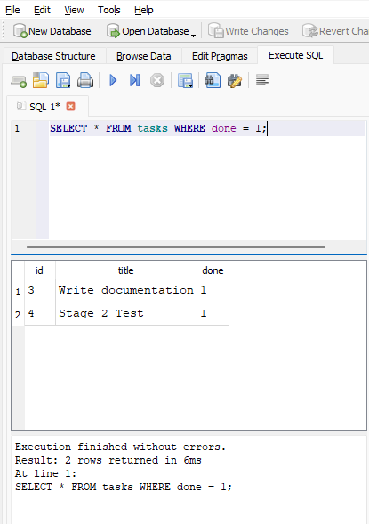

# Task API — SQLite CRUD Project


A clean, fully‑documented CRUD API for managing tasks, built with **Node.js**, **Express**, **SQLite**, and **Swagger UI**.  
This project demonstrates real‑world backend fundamentals: routing, validation, database persistence, OpenAPI documentation, and SQL execution.

---

## 📚 Table of Contents

- [Why SQLite?](#-why-sqlite)
- [Where the Database Lives](#-where-the-database-lives)
- [How to Start the Project](#️-how-to-start-the-project)
- [Screenshot of the Database](#️-screenshot-of-the-database)
- [Example SQL Query](#-example-sql-query-stage-4)
- [Project Structure](#-project-structure)
- [Tech Stack](#-tech-stack)
- [Running the Server](#-running-the-server)
- [API Endpoints](#-api-endpoints)
- [Example cURL Commands](#-example-curl-commands)
- [OpenAPI Specification](#-openapi-specification)
- [Stage 5 Checkpoint](#-stage-5-checkpoint--clean-clone-test)
- [Roadmap](#-roadmap)
- [Author](#-author)

---

## 📌 Why SQLite?

SQLite was chosen because:

- It is a **single‑file database** (`tasks.db`)
- Requires **zero setup** — no server, no installation, no config
- Works instantly on any OS
- Survives restarts and behaves consistently
- Perfect for small APIs and learning SQL fundamentals

---

## 📁 Where the Database Lives

The database file is:

```
tasks.db
```

It is created **automatically** on first run by `initDB()`.

Most projects **git‑ignore** this file so every clone starts fresh:

```
/tasks.db
```

---

## ▶️ How to Start the Project

```bash
node app.js
```

This command:

- Creates `tasks.db` automatically
- Creates the `tasks` table
- Seeds 3 example tasks
- Starts the API on port **3000**

---

## 🗄️ Screenshot of the Database



---

## 🧪 Example SQL Query (Stage 4)

```sql
SELECT * FROM tasks WHERE done = 1;
```

**What it returned:**  
It returned all tasks that were marked as completed.

---

## 📂 Project Structure

```
├── app.js
├── db.js
├── openapi.json
├── package.json
└── README.md
```

---

## 🧰 Tech Stack

- **Node.js** — JavaScript runtime
- **Express.js** — Web framework
- **SQLite** — Single‑file database
- **Swagger UI Express** — Interactive API documentation
- **OpenAPI 3.0** — API specification format

---

## 🚀 Running the Server

```bash
node app.js
```

**Server runs at:**

```
http://localhost:3000
```

**Swagger UI runs at:**

```
http://localhost:3000/docs
```

---

## 🔗 API Endpoints

### **GET /tasks — List all tasks**

Returns an array of all tasks.

### **POST /tasks — Create a new task**

Creates a task with a title and sets `done` to `false`.

### **GET /tasks/{id} — Get a task by ID**

Returns a single task if found.

### **PUT /tasks/{id} — Update a task**

Updates the title and/or done status.

### **DELETE /tasks/{id} — Delete a task**

Deletes the task and returns `204 No Content`.

---

## 💻 Example cURL Commands

### **Create a task**

```bash
curl -X POST http://localhost:3000/tasks \
  -H "Content-Type: application/json" \
  -d '{"title": "Buy milk"}'
```

### **Read all tasks**

```bash
curl http://localhost:3000/tasks
```

### **Read a task by ID**

```bash
curl http://localhost:3000/tasks/4
```

### **Update a task**

```bash
curl -X PUT http://localhost:3000/tasks/4 \
  -H "Content-Type: application/json" \
  -d '{"done": true}'
```

### **Delete a task**

```bash
curl -X DELETE http://localhost:3000/tasks/4
```

---

## 📘 OpenAPI Specification

Your `openapi.json` describes all endpoints, parameters, request bodies, and responses.  
Swagger UI uses this file to generate interactive documentation.


---

## 🧪 Stage 5 Checkpoint — Clean Clone Test

A stranger should be able to:

1. Clone your repo
2. Run:

   ```bash
   node app.js
   ```

3. See:
   - `tasks.db` created automatically
   - 3 seeded tasks
   - `GET /tasks` returning:

     ```json
     [
       { "id": 1, "title": "Learn Express", "done": false },
       { "id": 2, "title": "Build CRUD API", "done": false },
       { "id": 3, "title": "Write documentation", "done": true }
     ]
     ```

No manual setup. No SQL required. No extra steps.

---

## 🛣️ Roadmap

- Add sorting, filtering, pagination
- Add validation middleware (Zod or Joi)
- Add service + controller architecture
- Add automated tests (Jest + Supertest)
- Add Docker support
- Add frontend integration (React/Vue)

---

## 👤 Author

**Ralph Henry L. Dominisac**  
Task API — Express.js CRUD Project  
2026
